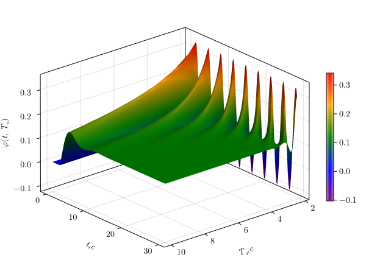

Здесь лежат исходные файлы и готовые результаты моих работ по теории автоматического регулирования. Моделирование сделано на языке Julia с помощью пакетов DifferentialEquations.jl и Makie.jl и среды Pluto.

<!--  -->

